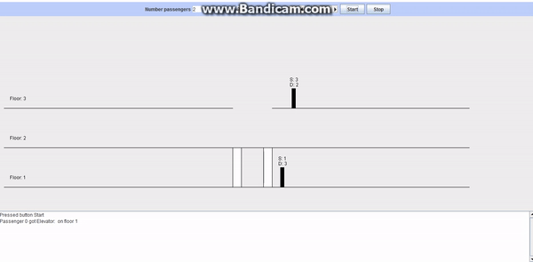

# Elevator

### The task:
We have a building in several floors, in which there is a lift of a certain capacity. On the floors of the building are people who want to move to another floor. We need to organize their transportation with the help of an elevator.
##Version 1
### Initial data:
- Number of floors in the building (NUMBER_FLOORS)
- Number of elevators in the building (NUMBER_ELEVATORS)
- Number of people that each elevator can hold (ELEVATOR_CAPACITY)
- Number of passenger in building (NUMBER_PASSENGERS)

### Initialization after application startup:
- For each passenger creates its own flow, which is realized through the implementation of the interface Runnuble
- For each elevator, it creates its own thread, which is implemented using inheritance from the Thread class
- The required number (NUMBER_PASSENGERS) of passengers' passengers (Passenger) is created, which are randomly arranged on floors.

> It means that using the Random class for each passenger, the initial (currentFloor) and the final floor (stopFloor) are formed, so that the initial floor on which the passenger is waiting for his carriage is not equal to the final floor.

### The transportation process:
- The elevator moves in series between floors in the up-down cycle
- Stops on each floor
- After the elevator arrives on the floor, passengers who need to exit on this floor leave the elevator, and who need to move to another floor enter the elevator
- After the end of all operations of landing or disembarking passengers, the elevator moves to the next floor

### End of the transportation process:
- When there are no passengers left to move, the elevators must be stopped and the flows corresponding to them are complete

### Logging of the transportation process:
All stages of landing / disembarking passengers, as well as moving the elevator between the floors are logged into a special logfile (log_file.log) and displayed on the console. All logging is done using the library (Log4j), whose configuration is in the resource directory.

##Version 2

###Initial data
- Number of floors in the building (inputNumberFloors)
- Number of people that each elevator can hold (inputCapacity)
- Number of passenger in building (inputNumberPassengers)

### Demo
